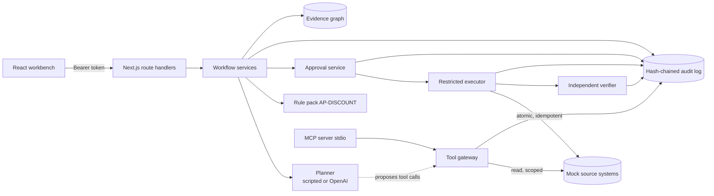

# ExceptionIQ v2 — specification

Status: implemented and tested (hackathon MVP scope). Owner: engineering lead. Source brief: *ExceptionIQ idea document* (Flo 2026 Nagarro × OpenAI Codex Hackathon).

## 1. Goal and scope

Demonstrate one complete, governed investigation of an unmatched vendor payment, plus the failure variants the brief requires, with every control enforced in code and proven by tests.

**In scope:**
- synthetic Bank, ERP, Invoice/PO, Vendor and Contract systems;
- adaptive investigation through allowlisted read tools;
- the Evidence Graph;
- deterministic rules;
- controller approval bound to exact payload, evidence and policy;
- a restricted executor making mock writes;
- independent verification;
- a hash-chained audit log;
- a role-aware workbench;
- an MCP server for the read tools.

**Non-goals (unchanged from the brief):** live bank or ERP access, real money movement, autonomous payment release, vendor bank-detail changes, compliance certification, multi-tenant SaaS hardening.

## 2. Architecture



All business logic lives in `backend/src` and has no dependency on Next.js. Route handlers are thin adapters wrapped by `http/handler.ts`, which handles authentication, Zod body validation and error mapping. This keeps the core unit-testable and lets the HTTP layer be swapped without touching controls.

### Key decisions

| # | Decision | Rationale | Trade-off |
|---|---|---|---|
| D1 | Keep Next.js API + React/Vite from v1 | Team familiarity; v1 brand preserved | Two dev servers (Vite proxies `/api`, so the browser sees one origin) |
| D2 | SQLite via Node's built-in `node:sqlite` instead of a JSON file | Relational model the brief asks for; real transactions for atomic writes; triggers for append-only audit; **no native build step**. `better-sqlite3` was used first, but a fresh-clone check showed `npm ci` tries to compile it from source, which fails on machines without a C++ toolchain | Single-writer; Node marks the module experimental (prints a warning); production would move to Postgres (same schema shape) |
| D3 | Money as integer minor units, rates as basis points, BigInt multiplication | Exactness; a non-exact discount is escalated rather than rounded | Rounding policy must be added explicitly by finance |
| D4 | Planner interface with deterministic and OpenAI implementations | Reproducible demos and tests without a key; the model is swappable | The deterministic planner is less adaptive than a model |
| D5 | Gateway as the only data path for the agent; scope expands only through retrieved evidence | Makes the boundary architectural (OWASP LLM01/LLM06) | New tools need a contract, scope rule and tests |
| D6 | Approval binds `payload_hash`, `evidence_hash` (manifest of id+version+hash), `policy_version`, expiry | Brief §4: changed or expired requests need re-approval | Any upstream record change invalidates approval, by design |
| D7 | Executor re-checks everything inside its own call and transaction | Never trust the UI, the model or the approval screen | Some checks duplicate the approval service on purpose |
| D8 | Audit log hash chain + DB triggers | Tamper-evident even against someone who bypasses triggers | Production should add external, independently retained storage |
| D9 | Safety metrics computed by SQL over records, not counters | An injected rogue execution is detected (tested) | Slightly heavier queries |
| D10 | Out-of-entity cases return 404, not 403 | Avoids confirming existence across tenants | Debugging requires correct persona |

## 3. Domain model

**Mock source systems** (each row has a `version` that increments on change):
- `bank_transactions`
- `erp_open_items`
- `invoices`
- `purchase_orders`
- `vendors` — beneficiary account plus a one-way fingerprint
- `contracts` — clause text plus `approved_terms`, the finance-approved structured terms (JSON)
- `payment_matches`
- `ledger_journals`

**Case management:**
- `cases` — includes `version` for optimistic locking and `faults` for fault injection
- `case_plans` — one row per investigation run: planner, model, prompt version, hypotheses, rule results
- `tool_calls` — every allowed or denied call, with rationale and source references
- `graph_nodes` and `graph_edges`
- `proposals`
- `approvals`
- `executions` — unique `idempotency_key`
- `verifications`
- `denied_actions`
- `audit_events` — append-only, hash-chained

### Evidence Graph

- **Node types:** Case, SourceRecord, Clause, Finding, RuleResult, Proposal, Approval, Action, Verification.
- **Edge types:** `supports`, `contradicts`, `derived_from`, `evaluated_by`, `authorized_by`, `verified_by`, `proposes`, `executes`.

Invariants enforced in `graph/evidence.ts`:
- SourceRecord nodes always carry the table, version, content hash and retrieving tool-call ID.
- A Finding marked SUPPORTED must link to at least one existing node in the same case.
- Edges cannot cross cases.

## 4. Case state machine

```
OPEN → INVESTIGATING → AWAITING_APPROVAL → APPROVED → EXECUTING → VERIFYING → CLOSED
                    ↘ NEEDS_REVIEW ↗ (re-investigate)      ↘ NEEDS_REVIEW (expired, evidence changed, write failed, verification failed)
                    ↘ BLOCKED → INVESTIGATING
```

- **Transitions.** Only those listed in `domain/stateMachine.ts` are legal.
- **Closure.** CLOSED is reachable only from VERIFYING, and only when every verification check passes.
- **Concurrency.** Each transition uses optimistic concurrency on `cases.version` and appends an audit event.

## 5. Investigation (idea doc §6 steps 2–5)

1. **Start.** An analyst (`case:investigate`) starts a run; any outstanding proposal is superseded.
2. **Hypotheses.** The planner proposes them: early-payment discount, bank fee, partial payment, duplicate settlement, wrong reference.
3. **Loop.** Bounded by `MAX_TOOL_CALLS`, `MAX_INVESTIGATION_MS` and a planner-error budget.
   - The planner proposes one tool call; the gateway validates and logs it.
   - Allowed results become SourceRecord nodes.
   - The default order follows the brief: Bank → ERP (including cleared items, to detect duplicates) → Invoice/PO → Vendor → Contract, the last only if a residual remains.
4. **Clause extraction.**
   - The deterministic extractor always runs.
   - With the OpenAI planner, the model's extraction also runs, and its quoted sentence must appear in the source text, otherwise it is discarded as a hallucination.
   - Disagreement between the two forces review.
5. **Screening.** Injection screening produces a FLAGGED finding.
6. **Rules.** The rule pack evaluates the evidence (§6), producing RuleResult nodes and findings, and hypotheses are updated from rule results only.
7. **Outcome.**
   - PROPOSE creates a proposal with risk class `ACCOUNTING_ADJUSTMENT` and moves the case to AWAITING_APPROVAL.
   - BLOCK moves it to BLOCKED.
   - Anything else moves it to NEEDS_REVIEW with reasons.
8. **Explanation.** The explanation is drafted by the planner and labelled in the UI as non-authoritative.

## 6. Rule pack AP-DISCOUNT v1.2.0

| Rule | Check | On failure |
|---|---|---|
| R01 | Required evidence retrieved (contract only if residual ≠ 0) | Review |
| R02 | Bank, invoice, open-item currencies equal | **Block** |
| R03 | Vendor verified; beneficiary fingerprint matches; invoice/open item vendor match | **Block** |
| R04 | Invoice → approved PO, same vendor and currency | Review |
| R05 | Open item OPEN; no existing match for invoice or bank txn | **Block** |
| R06 | ERP residual = invoice − paid, exactly | Review |
| R07 | Contract referenced by invoice, same vendor, effective on invoice date | Review |
| R08 | Finance-approved term exists and extracted clause matches it exactly | Review (missing term ⇒ no inferred entitlement) |
| R09 | 0 ≤ calendar days(invoice date → value date) ≤ window (inclusive) | Review |
| R10 | base × rate is exact in minor units and invoice − discount = paid | Review |

Rules are pure functions (`rules/discountPolicy.ts`) and record their inputs and outputs as `facts` for reproducibility. Changing a rule is a code change with tests (brief §4).

## 7. Approval, execution and verification

**Approval** (`workflow/approvals.ts`):
- requires the CONTROLLER role in the case's entity;
- requires that the approver is not the proposer or investigator;
- requires a reason for rejection;
- checks payload integrity;
- re-reads every record in the evidence manifest — if any changed, the proposal is superseded and the case goes to review;
- records the hashes and policy version, with expiry `APPROVAL_TTL_MINUTES`.

**Execution** (`workflow/execute.ts`, runs as `svc-executor`):
1. Idempotency key = sha256(proposal + payload hash). A repeat returns the original result; a previously FAILED attempt is never retried blindly.
2. Re-check: proposal APPROVED, approval exists and is APPROVED, approver ≠ proposer, payload hash recomputed equals the binding, evidence hash equal, policy version current, not expired, evidence fresh.
3. One SQLite transaction with fresh preconditions: open item OPEN, residual equals the approved discount, no existing match, journal balanced. It then inserts the journal, inserts the match, and clears the open item.
4. Any error rolls back everything; the execution is recorded as FAILED and the case goes to NEEDS_REVIEW.

**Verification** (`workflow/verify.ts`, runs as `svc-verifier`) re-reads the tables directly:
- residual is 0;
- status is CLEARED;
- the discount flag is set;
- there is exactly one match for the bank transaction, to the approved invoice and amount;
- the invoice has a unique payment link;
- there is exactly one balanced journal equal to the discount.

If every check passes, the case moves to CLOSED; otherwise it goes to NEEDS_REVIEW with compensating-action guidance ("do not retry; reconcile or reverse via a new approved proposal").

## 8. Security model

| Control | Implementation |
|---|---|
| Identity | scrypt password hashes; HMAC-signed bearer tokens with expiry; `sessionStorage` on the client |
| RBAC (deny by default) | `security/rbac.ts`. Analyst: read, create, investigate, trigger execution. Controller: read, decide approvals, trigger execution. Admin: read, reset/simulate (demo only); **no approval** |
| Entity boundary | Checked on every case operation; list filtered; 404 outside scope |
| Tool boundary | Allowlist; caller classes (agent/engine/executor/verifier); strict Zod schemas; evidence-linked scope; budgets |
| Untrusted content | Retrieved text never changes permissions; model prompts wrap it as untrusted; screening flags it |
| Data minimisation | Account numbers masked in tool output, prompts, logs and audit data |
| Input validation | Strict Zod bodies (unknown fields rejected); errors never leak stack traces or SQL |
| CORS | Origin allowlist; preflight handled; Vite proxy in development |
| Audit | Append-only triggers + hash chain; verification endpoint; per-case export bundle |

## 9. API

All routes except `auth/login`, `auth/personas` and `health` require `Authorization: Bearer <token>`.

| Method | Path | Purpose | Permission |
|---|---|---|---|
| POST | `/api/auth/login` | Sign in | — |
| GET | `/api/auth/me` | Current user + permissions | any |
| GET | `/api/auth/personas` | Demo personas (demo mode only) | — |
| GET | `/api/cases` | Cases in your entities | case:read |
| GET | `/api/cases/:id` | Full case detail (plan, trace, graph, proposals, approvals, executions, verifications, audit) | case:read |
| POST | `/api/cases/:id/investigate` | Run an investigation | case:investigate |
| POST | `/api/cases/:id/decision` | `{proposalId, decision, reason?}` | approval:decide |
| POST | `/api/cases/:id/execute` | `{proposalId}` | execution:trigger |
| GET | `/api/cases/:id/export` | Audit bundle with chain verification | audit:read |
| GET | `/api/audit` | Recent events + chain verification | audit:read |
| GET | `/api/metrics` | Status counts, safety gates, denials | case:read |
| GET | `/api/catalog` | Rules, tools, scenarios, permissions, transitions, policy matrix | any |
| POST | `/api/admin/reset` | Reset demo data | admin:reset |
| POST | `/api/admin/simulate-change` | Amend a linked contract | admin:simulate |
| GET | `/api/health` | Liveness, planner, policy version | — |

Errors have the shape `{ "error": { "code": "NOT_APPROVED", "message": "...", "details": null } }`.

## 10. Requirement traceability (brief §5 and §8 test list)

| Requirement from the idea document | Where enforced | Test |
|---|---|---|
| Happy path B-104 / INV-204, INR 2,000 = 2% × 100,000 | rules R06–R10, executor, verifier | `scenarios.test.ts` happy path |
| Discount boundary dates | R09 | `rules.test.ts` day 0/10/11/before |
| Decimal amounts | `domain/money.ts`, R10 | `domain.test.ts`, `rules.test.ts` |
| Duplicate settlement | R05 | DUPLICATE_SETTLEMENT scenario, rules |
| Missing contract / clause | R01, R08 | MISSING_CLAUSE scenario, rules |
| Wrong vendor / currency | R03, R02 | VENDOR_MISMATCH, CURRENCY_MISMATCH |
| Cross-entity access | `requireEntity`, list filter | `governance.test.ts`, `api.test.ts` |
| Untrusted instructions | gateway allowlist, screening, redaction | PROMPT_INJECTION scenario, `gateway.test.ts`, hostile planner |
| Rejected approval | approvals + executor | `governance.test.ts` |
| Expired approval | executor expiry | `governance.test.ts` (injected clock) |
| Evidence changing after approval | manifest re-read | `governance.test.ts` (before and after approval) |
| Payload changed after approval | hash recompute | `governance.test.ts` |
| Repeated execution | idempotency key | `governance.test.ts` (one journal, one match) |
| Write failure | transaction rollback, no blind retry | WRITE_FAILURE scenario + governance |
| Verification failure | independent verifier | VERIFY_FAILURE scenario + governance |
| Agent cannot self-approve or alter policy | caller classes, RBAC | `gateway.test.ts`, governance |
| Zero unauthorized writes | SQL safety metric | `governance.test.ts` (including rogue-row detection) |
| Audit completeness and integrity | hash chain, triggers | `audit.test.ts` |
| Model failure → bounded retry → review | planner error budget | `openaiPlanner.test.ts` |

**Mutation check.** Four controls were deliberately disabled one at a time: expiry, separation of duties, scope check, and an off-by-one in the discount window. The suite failed in every case.

## 11. Production path (pilot hardening, not built)

- **Data and access:**
  - Postgres with row-level security per entity;
  - enterprise SSO (OIDC) replacing demo passwords;
  - managed secret store;
  - encrypted storage.
- **Audit and observability:**
  - WORM/external retention for audit events, with periodic anchoring of the chain head;
  - OpenTelemetry tracing.
- **Runtime:**
  - queue-based workers for investigations;
  - per-tenant budgets, rate limits, and connector health checks.
- **Real adapters:** must handle pagination, rate limits, timeouts and error mapping, with non-transactional systems handled via sagas or compensating actions.
- **Finance sign-off** is needed on rounding, taxes, FX, holidays, partial payments, contract precedence and GL accounts.
- **Governance:** a model-evaluation harness comparing planner proposals against an independent controller review (brief §9), and a security review and threat model before any live data.
